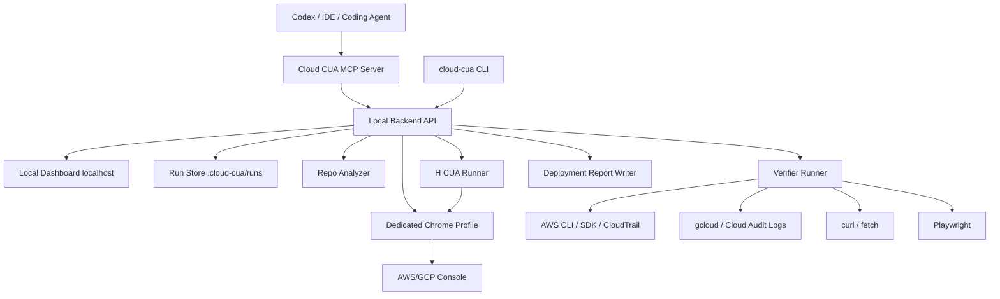

# Design Document: Cloud CUA

## Overview

Cloud CUA is a local-first deployment assistant. It lets a coding agent such as Codex start a deployment from the repo, while a human supervises in a local dashboard and H Company CUA operates the logged-in cloud console.

The system is intentionally not SaaS-first. AWS/GCP login, MFA, SSO, and captcha are handled by the human in a dedicated local browser profile. After the user confirms login, H CUA operates that same browser session.

The MVP has two phases:

1. **Local control loop MVP**: Codex calls Cloud CUA through MCP, dashboard opens, login modal blocks, H CUA performs inspect-only browser tasks, independent verifiers run, event log and report are written.
2. **First deployment MVP**: frontend-style repo deploys through AWS Amplify, with H CUA operating console setup and AWS/HTTP/Playwright verifiers proving the result.

ECS Express Mode and GCP Cloud Run are designed as later deployment adapters, not first scope.

## Design Principles

1. **Cloud CUA coordinates; Codex and H CUA do not free-chat.** All coordination goes through explicit tools, run state, and event logs.
2. **CUA acts visually, verifiers prove reality.** H CUA can observe and operate the console, but the verifier stack checks APIs, audit logs, URLs, and repo state.
3. **Local-first for login and trust.** The user logs into cloud consoles on their own machine. Secrets stay local by default.
4. **Small tool calls beat vague autonomy.** Every H CUA task is short, scoped, and has success criteria.
5. **Mode is policy.** Vibe, Teach, and Expert mode change behavior, not architecture.
6. **First target must be narrow and real.** AWS Amplify is first because it gives meaningful console work and a verifiable deployed URL.

## High-Level Architecture



## Runtime Components

### CLI Launcher

`cloud-cua` is the installation and runtime command.

Commands:

```bash
cloud-cua init
cloud-cua start
cloud-cua mcp
```

Responsibilities:

- create `~/.cloud-cua/`;
- store `credentials.env`;
- validate `HAI_API_KEY`;
- optionally validate `GRADIUM_API_KEY`;
- start the local backend;
- open or print dashboard URL;
- run the MCP server over stdio;
- install or print MCP config snippets for Codex/Kiro/Cursor later.

The CLI is not the main product UI. It exists to make the MCP server and dashboard reliable.

### Local Backend

The backend owns state and orchestration.

Recommended MVP stack:

- Python FastAPI for the backend because H local browser control is Python SDK centered.
- Static or Vite/React dashboard served separately or by the backend.
- JSONL files for run persistence before adding a database.

Core modules:

```text
cloud_cua/
  cli.py
  server.py
  mcp_server.py
  credentials.py
  repo_analyzer.py
  run_store.py
  mode_policy.py
  browser_profile.py
  h_runner.py
  voice_router.py
  verifier/
    base.py
    aws.py
    gcp.py
    http.py
    playwright.py
    repo.py
  deployments/
    amplify.py
    ecs_express.py
    cloud_run.py
  reports.py
  voice_gradium.py
```

### MCP Server

The MCP server is the agent-facing surface. Codex calls tools; the backend executes or records the requested action.

Minimum tools:

```text
cloud_cua_start_deployment(repo_path, cloud, mode)
cloud_cua_open_dashboard(run_id)
cloud_cua_get_status(run_id)
cloud_cua_get_recent_events(run_id, limit)
cloud_cua_set_mode(run_id, mode)
cloud_cua_send_user_message(run_id, message)
cloud_cua_submit_codex_plan(run_id, plan)
cloud_cua_submit_objection(run_id, objection, evidence)
cloud_cua_pause_h_cua(run_id)
cloud_cua_resume_h_cua(run_id)
cloud_cua_request_approval(run_id, action, reason)
cloud_cua_run_verifier(run_id, verifier_name)
cloud_cua_write_report(run_id)
```

Design rule:

- MCP tools return structured data.
- Long-running work returns a `run_id` and status, not a giant blocking transcript.
- Codex reads progress through `cloud_cua_get_status` and `cloud_cua_get_recent_events`.

### Local Dashboard

The dashboard is the human-facing surface.

Required screens/panels:

- repo summary;
- cloud provider and deployment target;
- current mode control: `[ Vibe ] [ Teach ] [ Expert ]`;
- blocking login modal;
- H CUA status and pause/resume;
- activity feed from `events.jsonl`;
- approvals panel;
- verifier results panel;
- voice panel for Teach Mode;
- final live URL and report link.

The dashboard must distinguish:

- **H observation**: what the CUA says it saw or did.
- **Verifier result**: what independent commands prove.
- **Codex objection**: repo/design concern raised by Codex.
- **User approval**: explicit human decision.

## Run State

### Run Directory

Each run is stored locally:

```text
.cloud-cua/runs/<run-id>/
  run.json
  events.jsonl
  verifier-results/
  h-cua/
  report-draft.md
```

No secrets are written to run artifacts.

### Run Object

```json
{
  "run_id": "2026-07-11T120000Z-abc123",
  "repo_path": "C:/path/to/repo",
  "cloud": "aws",
  "target": "aws_amplify",
  "mode": "vibe",
  "status": "created | waiting_for_login | running | paused | verifying | completed | blocked | failed",
  "current_step": "string",
  "dashboard_url": "http://localhost:3000/runs/<run-id>",
  "created_at": "ISO-8601",
  "updated_at": "ISO-8601"
}
```

### Event Shape

```json
{
  "time": "2026-07-11T12:00:00Z",
  "source": "system | user | codex | h_cua | verifier",
  "type": "plan | command | observation | objection | approval | mode_changed | voice_command | result | error",
  "message": "Plain-English event text",
  "evidence": {}
}
```

Event append rules:

- append-only;
- one JSON object per line;
- no secret values;
- every H CUA task and verifier command creates events;
- mode changes and approvals are always recorded.

## Browser Design

### Dedicated Profile

Cloud CUA must use a dedicated profile for cloud-console work.

Default paths:

```text
~/.cloud-cua/chrome-profile
```

Windows:

```text
C:\Users\<user>\.cloud-cua\chrome-profile
```

Flow:

1. backend starts or attaches to the dedicated browser profile;
2. browser opens AWS/GCP console;
3. dashboard shows blocking Login_Modal;
4. user logs in manually;
5. user clicks Continue;
6. backend starts H CUA local browser control or a HoloDesktop task against the same visible browser.

### Login Modal

The Login_Modal is a hard gate.

AWS copy:

```text
Log into AWS in this browser window. Click Continue when done.
```

GCP copy:

```text
Log into GCP in this browser window. Click Continue when done.
```

Behavior:

- blur or dim dashboard background;
- no H CUA cloud operation until Continue;
- user can cancel run;
- if user continues but verifier cannot identify cloud account/project, return to blocked state.

## Repo Analyzer

The analyzer produces `Repo_Context`.

Inputs:

- `package.json`, lockfiles, build scripts;
- `next.config.*`, `vite.config.*`, framework markers;
- `Dockerfile`;
- `.env.example`, `.env.local` names only, never secret values;
- git status;
- source file hints for ports and app type.

Output:

```json
{
  "framework": "nextjs | vite | react | static | express | fastapi | unknown",
  "category": "frontend_static | nextjs | containerized_web | api_service | unknown",
  "package_manager": "npm | pnpm | yarn | bun | unknown",
  "build_command": "npm run build",
  "output_directory": "dist | build | .next | unknown",
  "start_command": "string | null",
  "dockerfile": true,
  "env_vars": ["DATABASE_URL", "NEXT_PUBLIC_API_URL"],
  "risks": ["missing env example", "unknown output dir"]
}
```

Codex can refine this analysis, but Cloud CUA should have deterministic local scanners first.

## Deployment Adapters

### AWS Amplify Adapter - First Real Target

Supported repo category:

- frontend/static;
- Vite/React;
- simple Next.js frontend path when build/output can be inferred.

Responsibilities:

- prepare Amplify deployment plan;
- tell H CUA exactly what console page/fields to inspect or operate;
- pause for GitHub OAuth/account linking;
- collect branch, app name, build command, output dir, env vars;
- run AWS Amplify verifiers;
- run live URL checks;
- write report.

Verifier commands:

```bash
aws sts get-caller-identity
aws amplify list-apps
aws amplify list-branches --app-id <app-id>
curl -I <amplify-url>
npx playwright test
```

CloudTrail event examples to look for:

```text
CreateApp
CreateBranch
StartJob
UpdateApp
UpdateBranch
```

### ECS Express Mode Adapter - Planned

Use after MVP when containerized apps are supported.

Required before enabling:

- Dockerfile generation or validation;
- container image build/push story;
- ECS service verifier;
- ALB/live URL verifier;
- cost approval gate.

### GCP Cloud Run Adapter - Planned

Use after AWS Amplify MVP.

Required before enabling:

- `gcloud` auth/project verification;
- service deploy/describe verification;
- Cloud Audit Logs query;
- live URL and Playwright checks.

## Mode Policy

Mode policy is evaluated at every step.

### Vibe Mode

Policy:

- minimal questions;
- safe defaults;
- short explanations;
- approval only for cost/security/destructive/public/secrets/login;
- final summary in plain language.

### Teach Mode

Policy:

- explain each major cloud concept;
- use simple words;
- tie explanations to the current screen;
- allow voice questions through Gradium when configured;
- text fallback when Gradium is unavailable.

Gradium usage:

- STT turns user voice into text;
- the local Voice Router classifies the text before Codex or H CUA sees it;
- TTS reads short explanations;
- Gradium does not choose cloud actions.

### Expert Mode

Policy:

- ask tradeoff questions;
- expose config details;
- let user override supported settings;
- avoid beginner explanations.

Example tradeoff prompts:

```text
Use Amplify for a faster frontend deployment, or wait for ECS support for container-level control?
Use this existing env var list, or stop until .env.example is complete?
Create a public app URL now, or keep this as a draft deployment until domain/security review?
```

## H CUA Runner

The H runner is responsible for bounded H tasks.

Task format:

```json
{
  "run_id": "string",
  "task": "Open the AWS Amplify console and report whether a GitHub account is already connected. Do not change anything.",
  "success_criteria": "Return connected/not_connected and visible account/workspace labels if present.",
  "max_steps": 20,
  "mode": "vibe | teach | expert"
}
```

Rules:

- inspect-only tasks come before modifying tasks;
- modifying tasks require approval if paid/risky;
- all tasks log command and result;
- blocked/timed-out tasks stop the workflow until user/Codex decides next step;
- prefer short tasks because HoloDesktop MCP calls can be blocking.

## Verifier Design

The verifier stack is independent of CUA.

Verifier layers:

1. **Repo verifier**: git diff and build/test commands.
2. **Identity verifier**: cloud account/project identity.
3. **Resource verifier**: cloud service describe/list APIs.
4. **Action verifier**: CloudTrail or Cloud Audit Logs.
5. **Live URL verifier**: HTTP response.
6. **Render verifier**: Playwright render check.
7. **Report verifier**: final report and event log exist.

Verifier result shape:

```json
{
  "name": "aws_identity",
  "status": "passed | failed | skipped",
  "command": "aws sts get-caller-identity",
  "summary": "Verified account 123456789012",
  "raw_path": ".cloud-cua/runs/<run-id>/verifier-results/aws_identity.json",
  "risk": null
}
```

CloudWatch and Cloud Logging are debug tools, not first-line verifiers because they can create cost and noise. Use them after a failed live URL or unhealthy resource result.

Terraform is not a primary verifier. Later it can generate import notes or IaC consistency warnings.

## Approval Gates

Approval object:

```json
{
  "approval_id": "string",
  "run_id": "string",
  "action": "Create AWS Amplify app",
  "reason": "This creates cloud resources and may incur cost.",
  "risk_level": "low | medium | high",
  "options": ["approve", "deny"],
  "status": "pending | approved | denied"
}
```

Required approvals:

- paid resources;
- broad IAM permissions;
- public network exposure;
- delete/replace actions;
- sharing secrets with cloud services;
- GitHub OAuth/account-linking consent.

## Voice Design

Gradium is optional but important for Teach Mode.

Voice has two lanes. Simple commands use the fast lane. Reasoning questions use the slow lane.

### Fast Lane: Direct Control Commands

Use this path for commands that do not need repo reasoning:

```text
pause
continue
stop
switch to Vibe mode
switch to Teach mode
switch to Expert mode
open logs
run verifier
mute voice
```

Flow:

```text
User voice
  -> browser microphone
  -> Gradium STT
  -> Voice Router
  -> backend/dashboard action
```

Codex is not called for fast-lane commands. H CUA is not called for fast-lane commands. The goal is low latency after STT returns text.

### Slow Lane: Reasoning and Planning

Use this path for questions or instructions that need repo/cloud reasoning:

```text
why Amplify?
what is IAM?
is this cheaper than Vercel?
explain this error
use the cheaper option
```

Flow:

```text
User voice
  -> browser microphone
  -> Gradium STT
  -> Voice Router
  -> Codex / explanation engine
  -> optional plan change or explanation
  -> optional Gradium TTS response
```

Cloud operation requests from voice are not sent directly to H CUA. They become planned actions, approval requests, or bounded H CUA tasks.

### TTS Output

TTS is output only. It speaks short dashboard/Codex explanations.

Flow:

```text
Cloud CUA explanation text
  -> Gradium TTS
  -> dashboard plays audio
```

Do not speak every internal event. Speak only user-relevant explanations, warnings, questions, and final results.

### Browser Key Security

The browser must not receive `GRADIUM_API_KEY`.

Allowed approaches:

1. backend sends recorded audio to Gradium and returns transcript/audio to the dashboard;
2. backend issues a short-lived browser token if Gradium's browser-token flow is used.

### Voice Event Shape

Every STT result creates a `voice_command` event:

```json
{
  "source": "user",
  "type": "voice_command",
  "message": "switch to Teach mode",
  "evidence": {
    "classification": "direct_control",
    "route": "backend",
    "action": "set_mode",
    "mode": "teach"
  }
}
```

Classifications:

- `direct_control`: backend/dashboard handles it immediately;
- `reasoning_question`: Codex or explanation engine handles it;
- `planned_cloud_action`: Cloud CUA creates a safe plan/approval before H CUA;
- `unknown`: ask the user to clarify.

### MVP Voice Flow

1. user presses voice button in dashboard;
2. audio goes to Gradium STT;
3. Voice Router classifies the transcript;
4. direct controls execute immediately in the backend;
5. reasoning questions go to Codex or the explanation engine;
6. planned cloud actions become approval-gated plans;
7. Teach Mode can return short TTS explanation.

If Gradium is missing or fails:

- dashboard shows text-only mode;
- deployment continues.

## Error Handling

### Missing Credentials

If `HAI_API_KEY` is missing:

- dashboard/setup prompts user;
- H CUA cannot start;
- repo analysis and dashboard can still run.

If `GRADIUM_API_KEY` is missing:

- voice disabled;
- Teach Mode remains text-only.

### Browser Login Failure

If user clicks Continue but identity verifier fails:

- status becomes `blocked`;
- dashboard explains cloud account/project was not verified;
- H CUA does not continue modifying cloud resources.

### H CUA Blocked

If H CUA hits login wall, captcha, MFA, missing permissions, timeout, or ambiguous success:

- stop H CUA;
- write event;
- run safe verifiers where possible;
- ask user/Codex for next action.

### Verifier Failure

If verifier fails:

- deployment is not marked complete;
- dashboard shows failed proof layer;
- Codex can inspect repo/logs and suggest fixes;
- report says blocked/failed with next action.

### Unsupported Repo

If repo does not fit implemented target:

- stop before cloud changes;
- write report;
- list planned targets if relevant.

## Testing Strategy

### Unit Tests

- credential path and loading;
- repo analyzer classifications;
- mode policy behavior;
- event log append and no-secret filtering;
- approval gate logic;
- verifier result parsing.

### Integration Tests

- MCP `start_deployment` creates run and dashboard URL;
- mode switch writes event and updates status;
- login modal blocks H CUA until Continue;
- H runner receives bounded task payload;
- verifier runner writes artifacts and status;
- report writer includes required sections.

### End-to-End MVP Test

Use a sample frontend repo.

Expected path:

1. Codex/MCP starts run.
2. Dashboard opens.
3. Login modal appears.
4. User marks login complete.
5. H CUA inspects AWS Amplify.
6. User approves required setup action.
7. H CUA performs bounded Amplify setup task.
8. AWS verifiers run.
9. URL and Playwright checks run.
10. report is written.

### Manual Demo Checks

- user can switch Vibe/Teach/Expert mid-run;
- Teach Mode can answer a voice question if Gradium is configured;
- pause button stops or prevents next H task;
- H CUA observations and verifier results are visually separate.

## Security Notes

- Do not put `HAI_API_KEY` in repo files.
- Do not log secret values.
- Do not screenshot unrelated windows.
- Use a dedicated browser profile.
- Ask before paid resources or permissions.
- Make it clear that local H hosted-model mode may send task-relevant screen observations to H Company.
- Do not promise production-grade cloud security in the MVP.
