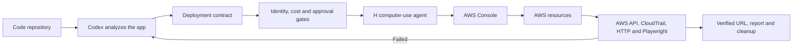

# Cloud CUA

**An H computer-use agent that deploys coding projects to AWS through the browser.**
Track 2: Browser Use

## The problem

Building an application has become much easier. Deploying and operating it has not.

Vercel is popular because it turns deployment into a few clicks. That is excellent for frontends and early products, but the tradeoff becomes clearer as an application grows: convenience can become expensive, infrastructure choices are narrower, and teams have less control over networking, security, compute, and data services.

AWS offers the opposite tradeoff. It can be more flexible and cost-efficient at scale, but it asks developers to understand a large and complicated cloud platform. “AWS expert” is a real job because deploying correctly involves IAM, networking, regions, containers, storage, monitoring, security, and cost management.

Our question was simple:

> Why not let a trusted browser agent handle the difficult AWS setup directly from the developer’s repository?


## Why is AWS still difficult?

A developer deploying to AWS must often:

- choose the correct service from hundreds of options;
- translate application details into cloud settings;
- configure IAM without granting excessive access;
- understand regions, VPCs, ports, health checks, and load balancers;
- avoid exposing secrets or private resources;
- interpret changing AWS Console workflows;
- recognize deprecated or restricted products;
- estimate cost and remove unused resources;
- prove that the deployed application actually works.

Small mistakes have large consequences. Selecting the wrong region, guessing a Docker port, using a broad IAM policy, or trusting a console success message can leave an application broken, insecure, or unexpectedly expensive.

## The solution

Cloud CUA is a deployment agent built around **H Company’s computer-use agent**.

It connects the coding environment to the AWS Console:

1. **Codex analyzes the repository** and extracts facts such as framework, build command, Docker image, application port, health path, and environment-variable names.
2. **Cloud CUA creates a deployment contract** containing the exact values and safety rules for this run.
3. **The user logs into AWS manually** in a dedicated browser profile and approves consequential actions.
4. **H operates the AWS Console visually**, using reviewed service skills and bounded milestones.
5. **Independent verifiers check the result** through AWS APIs, CloudTrail, HTTP, and Playwright.
6. **Cloud CUA writes a report and cleanup plan** tied to the exact resources created by the run.

H performs the browser work, but H does not grade its own work.



## Product

### Goal

Make AWS deployment feel as approachable as a managed deployment platform without hiding the control, flexibility, and service depth that make AWS valuable.

Cloud CUA should allow a developer to say:

```text
Deploy this repo with Cloud CUA in Vibe mode.
```

The system should select a supported AWS path, operate the browser safely, verify the application, and explain exactly what happened.

### Assumptions and constraints

- The developer has an AWS account and handles login, MFA, SSO, captcha, and password-manager prompts.
- H is the visible cloud-console operator.
- Codex is responsible for repository reasoning, not clicking through AWS.
- Cloud CUA runs locally and keeps credentials outside the repository.
- Paid, destructive, public, permission-related, and secret-related actions require approval.
- A browser-agent response is evidence, not proof; independent verification is required.
- Unknown facts block deployment instead of being guessed.
- The default AWS cost policy is capped at $5 unless the user approves an extension.
- Cleanup never silently deletes a live deployment.

### Scope of work

| Area | Current scope |
|---|---|
| Repository analysis | Vite, React, Next.js, static sites, Docker apps, APIs, serverless, and IaC detection |
| AWS deployment | Proven ECS Express and S3 paths; guarded Amplify, Lambda, and IaC planning |
| Browser operation | Dedicated Chrome profile, manual login, bounded H tasks, pause/resume/cancel |
| Safety | Account matching, approvals, cost policy, SSM secret references, tagged cleanup |
| Verification | AWS CLI/API, CloudTrail, resource state, HTTP, Playwright, and deployment report |
| H skills | 53 synchronized skills, including safety guidance for 50 AWS services |
| Evaluation | 150 cases covering provisioning, misconfiguration, and recovery/cleanup |
| GCP | Cloud Run planning only; live acceptance is not complete |

The 50-service skill catalog provides service-specific knowledge and warnings. It does not mean all 50 services already have production-ready automated deployment flows.

### Core features

| Feature | Behavior |
|---|---|
| Repository-aware deployment | Codex uses MCP to analyze the exact project and recommend a supported AWS path. |
| Browser milestones | H inspects, prepares without submitting, and submits once only after contract review. |
| Skills and contracts | Skills define reusable rules; contracts provide the exact image, port, region, health path, and tags. Required facts are never guessed. |
| Human control | The dashboard shows the current owner and allows pause, resume, cancel, approval, and live mode switching. |
| Voice supervision | Gradium routes controls to the backend, questions to Codex, and cloud operations through planning and approval—never directly to H. |
| Independent verification | AWS identity, resources, image, port, health, CloudTrail, HTTP, Playwright, report, and cleanup must pass. |
| Safe learning | Failures create review-only lesson candidates with evidence and regression tests; they never silently rewrite trusted skills. |

### Metrics and KPIs for success

| KPI | Success condition |
|---|---|
| Deployment correctness | Every required verifier passes for the exact run-tagged resource |
| Browser autonomy | H completes inspect, prepare, and submit milestones without unsupported intervention |
| Safety | Zero unapproved paid, destructive, public, secret, or broad-IAM actions |
| Configuration accuracy | Zero guessed required facts, including image, region, port, and health path |
| Recovery | Failed or interrupted H sessions stop safely and remain resumable or explainable |
| Cleanup | Zero unintended run-tagged resources remain after approved cleanup |
| Auditability | Every plan, approval, browser result, objection, verifier, and mode change is recorded |
| Repository portability | MCP can start one exact run from a repository outside the Cloud CUA source tree |
| Skill quality | Evaluation cases pass with full evidence and fail closed when a required fact is unknown |
| User control | Pause, resume, cancel, approval, and mode changes affect the active H session correctly |

## Install and run

### Install

```bash
# macOS or Linux
./scripts/install.sh

# Windows PowerShell
powershell -ExecutionPolicy Bypass -File scripts\install.ps1
```

The installer creates `~/.cloud-cua/runtime-venv` and registers the MCP server with Codex. Restart Codex after installation.

### Credentials

Store keys outside the repository in `~/.cloud-cua/credentials.env`:

```env
HAI_API_KEY=...
GRADIUM_API_KEY=...
```

`HAI_API_KEY` is required for H browser operation. `GRADIUM_API_KEY` is optional.

### Start

```bash
cloud-cua doctor
cloud-cua service start
```

Open `http://127.0.0.1:3000`.

### Development setup

```bash
python -m venv .venv
source .venv/bin/activate       # Windows: .venv\Scripts\activate
python -m pip install -e ".[h,dev]"
npm install
npx playwright install chromium
python -m cloud_cua.cli start
```

### Tests

```bash
PYTEST_DISABLE_PLUGIN_AUTOLOAD=1 python -m pytest -q
npm run visual:dashboard
```

## Documentation

- [Product requirements](.codexplan/requirements.md)
- [System design](.codexplan/design.md)
- [Implementation status](.codexplan/tasks.md)
- [AWS service evaluation catalog](docs/aws-h-evaluation-catalog.md)
- [Sample-project validation](docs/agent-test-validation.md)
