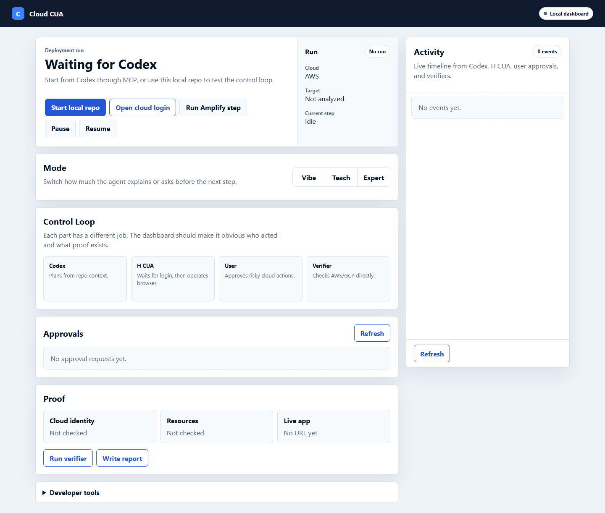
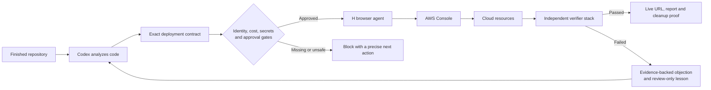
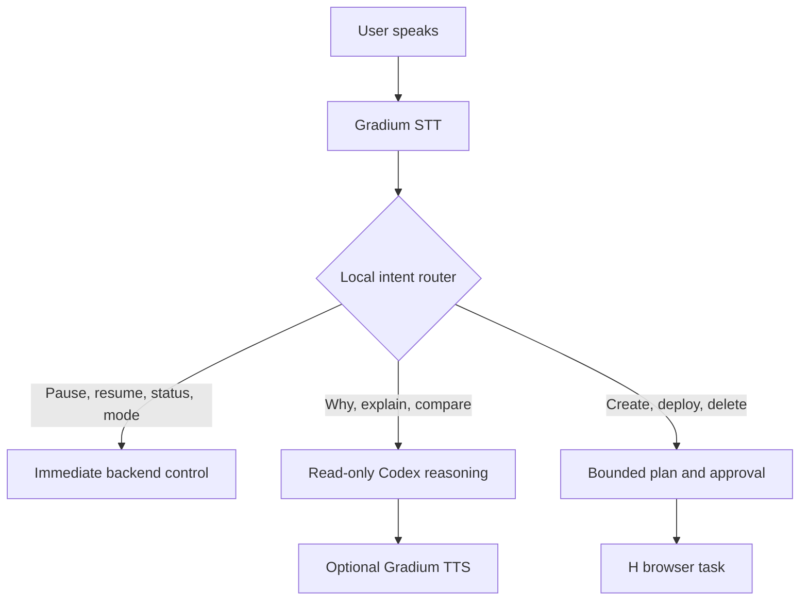
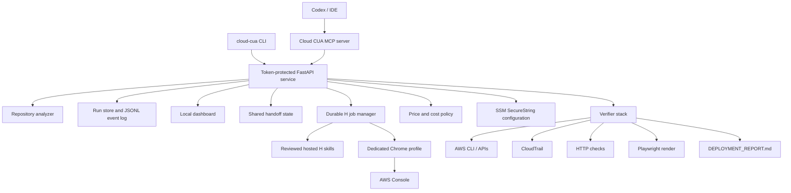

# Cloud CUA

### A browser-use deployment agent that turns a finished repository into a verified cloud deployment

**Track 2: Browser Use**

Cloud CUA connects three different strengths: **Codex understands the repository**, **H Company CUA operates the real cloud console**, and **independent verifiers prove that the deployment actually works**.

It is not a browser macro and it is not a chatbot that says “deployed” after clicking a green button. Cloud CUA is a local control system for safe, observable, and evidence-backed browser automation across AWS.



## The problem

We kept running into the same gap after building an application: writing the code had become fast, but deploying it was still a fragile manual process.

A developer has to identify the right cloud service, understand an unfamiliar console, configure IAM and networking, avoid expensive defaults, keep secrets out of logs, and determine whether the application is genuinely live. A general-purpose browser agent can click through these screens, but cloud consoles are unusually unforgiving. One wrong region, container port, policy, or submit click can create a broken deployment—or an expensive and insecure one.

The most dangerous part is that a browser agent can appear successful while being wrong. A console may display “created” even though the task is unhealthy, the wrong image was deployed, the public URL returns an error, or resources were left running after the demo.

We wanted a developer to be able to say:

```text
Deploy this repo with Cloud CUA in Vibe mode.
```

Then watch a browser agent perform the real work without surrendering identity, cost, security, or proof.

## Our approach

We separated the job into roles instead of asking one model to do everything:

- **Codex** reads the repository, identifies the framework and deployment requirements, and prepares an exact contract.
- **Cloud CUA** owns state, approvals, cost limits, secrets, handoffs, browser jobs, and recovery.
- **H Company CUA** visibly operates the logged-in AWS console through a dedicated browser session.
- **Independent verifiers** use AWS APIs, CloudTrail, HTTP, and Playwright to determine whether the result is real.
- **The user** retains control over login, approvals, voice commands, and cleanup decisions.

This creates a closed loop:



The important design decision is that **H acts, but H does not grade its own work**.

## Why this belongs in Track 2: Browser Use

Browser use is the center of the product, not a screenshot added to an API workflow.

H operates the same AWS console a human would use: navigating services, reading account context, inspecting forms, entering contract-bound values, responding to changing console state, and submitting approved actions. This matters because many real deployment steps involve dynamic interfaces, account-specific warnings, OAuth boundaries, managed-service wizards, and visual state that cannot be reduced to a fixed script.

Cloud CUA extends browser use in five ways:

1. **Repository-grounded browsing** — H receives facts extracted from the actual codebase rather than guessing from the page.
2. **Milestone supervision** — for ECS Express, H inspects first, prepares the form second, and submits exactly once only after contract review.
3. **Live human control** — the user can pause, resume, cancel, approve, change modes, or speak to the system while H is active.
4. **Durable browser jobs** — session ID, worker PID, milestone, heartbeat, event cursor, and recovery state survive backend restarts.
5. **Independent proof** — browser observations are compared with the resource API, audit trail, live HTTP response, and rendered page.

That combination makes the browser agent useful for consequential work while keeping it inspectable and correctable.

## What makes Cloud CUA different

### 1. A shared handoff, not an agent group chat

Cloud CUA always records who owns the next action: **user, Codex, H, or verifier**. The dashboard shows the current owner, state, and exact next step. Coordination is written to an append-only event log instead of disappearing inside model conversations.

### 2. Skills provide memory; contracts provide truth

Reusable YAML skills tell H how a service should be operated. A per-run `contract.json` supplies the exact facts for this deployment—image digest, application port, health path, region, required tags, public URL expectation, and skill hash.

This distinction prevents a common automation failure: applying a generally correct procedure with the wrong run-specific value.

Cloud CUA currently maintains:

- **53 synchronized H skills**;
- **50 AWS service evaluation suites**;
- **150 cases** spanning guided provisioning, misconfiguration traps, and recovery/cleanup.

For example, the ECR/ECS tests explicitly forbid H from guessing port 80. The application’s real listen port must come from the repository or Codex contract before deployment continues.

### 3. Safe learning instead of self-corruption

When H or a verifier fails, Cloud CUA creates `lesson_candidate.json` containing the evidence, a proposed general rule, and a required regression test. It never silently edits a trusted skill from one failure. A later strict success can mark the evidence resolved, but the history remains reviewable.

### 4. Voice is routed by intent

Gradium voice support has a fast lane and a reasoning lane:



Raw speech is never forwarded directly to H as a cloud instruction. High-risk voice approvals require the exact phrase displayed by the dashboard, and the Gradium API key never reaches browser JavaScript.

### 5. Honest failure is a feature

Cloud CUA blocks when it cannot establish identity, pricing, required configuration, target support, or verifier evidence. It does not convert “unknown” into a default just to finish the demo.

## Technical architecture



### Runtime

- Python 3.11+ and FastAPI
- MCP server for Codex integration
- H Company browser-agent SDK
- Dedicated Chrome profile with manual MFA/SSO/login
- AWS CLI and boto3 verification
- Playwright browser verification
- Gradium streaming STT/TTS for optional voice control
- JSON/JSONL run persistence; no database required

The installer creates an isolated runtime at `~/.cloud-cua/runtime-venv`. MCP is a thin client to one token-protected loopback service, so Codex can invoke Cloud CUA from any repository without creating duplicate backends or duplicate deployment runs.

### Durable run artifacts

Each deployment has a replayable directory:

```text
.cloud-cua/runs/<run-id>/
├── run.json
├── events.jsonl
├── handoff.json
├── contract.json
├── milestones.json
├── h-job.json
├── cost-policy.json
├── lesson_candidate.json
├── verifier-results/
└── report-draft.md
```

Secret values are sanitized from these artifacts.

## Safety model

Cloud deployment is consequential, so safety is part of the architecture:

- The user handles login, MFA, captcha, SSO, and password managers.
- H reads the visible AWS account ID; the backend compares it with `aws sts get-caller-identity` before modification.
- Paid actions, public exposure, broad IAM, destructive changes, secret sharing, and OAuth linking require approval.
- New secret values go directly from a blocking dashboard form to tagged SSM Standard `SecureString` parameters. Only ARNs enter contracts.
- `VITE_*` and `NEXT_PUBLIC_*` values are labeled public browser configuration, never secret storage.
- Required AWS prices come from the Price List API. Missing prices block the run instead of using fabricated estimates.
- The default policy cap is **$5**, with warnings at 50% and 80%. At 100%, the run requires cleanup or an approved extension.
- Cancellation stops the H session but never silently deletes live cloud resources.
- Cleanup is dry-run by default and targets only resources identified by Cloud CUA run tags.

Created resources use:

```text
cloud-cua=true
cloud-cua-repo=<repo-name>
cloud-cua-run=<run-id>
```

## Supported deployment paths

| Repository shape | Recommended path | Current status |
|---|---|---|
| Dockerized web app or API | ECR + ECS Express Mode | Real H-operated deployment verified and cleaned |
| Static frontend | S3 static website | Real H-operated deployment verified and cleaned |
| Vite, React, or Next.js frontend | AWS Amplify | Planning, milestones, frontend smokes, and verifiers implemented; final dedicated-browser acceptance remains |
| Function/serverless repository | AWS Lambda | Analysis and guarded planning |
| Terraform, SAM, or CDK | IaC review | Inspect and verify; no blind console drift |
| GCP HTTP service | Cloud Run | Planning-only until `gcloud`, project identity, live deployment, and cleanup are proven |
| AWS App Runner | Not selected for new customers | Lifecycle-aware blocker; ECS Express Mode recommended |
| Unknown repository | No automatic mutation | Stop and request clarification |

The 50-service skill catalog expands safe browser knowledge, but it does not falsely claim that all 50 services have production-ready automated deployment adapters.

## Demo: from repository to independently verified URL

### What the judge should watch

1. **Start from Codex** with an unrelated application repository.
2. Cloud CUA opens the exact run in the local dashboard and shows the detected framework and recommended target.
3. The dashboard blocks while the user manually logs into AWS.
4. H inspects the visible AWS account; Cloud CUA matches it against AWS CLI identity.
5. For a Docker app, Cloud CUA builds and pushes an immutable image to ECR and records its digest and real application port.
6. H opens ECS Express Mode, inspects the form, prepares contract-bound values, and waits.
7. The user approves creation; H submits once.
8. Independent checks verify the run tags, task definition image, container port, rollout, running task, target health, application URL, HTTP 200, rendered page, CloudTrail evidence, and report.
9. Cleanup previews only run-owned resources, deletes them after approval, and proves that zero tagged resources remain.

### Suggested two-minute demo script

```text
1. “Deploy this repo with Cloud CUA in Vibe mode.”
2. Show repo analysis and the shared owner/next-action strip.
3. Confirm manual AWS login.
4. Show H operating the AWS console.
5. Say “pause deployment,” then “resume deployment.”
6. Approve the bounded create action.
7. Show the live app and independent verifier results.
8. Open DEPLOYMENT_REPORT.md and the cleanup preview.
```

### Evidence already produced

- A real H-operated ECS Express run passed **all 16 contract-aware verifier checks**, returned HTTP 200, rendered in Playwright, and ended with zero cleanup actions.
- A real H-operated S3 website run passed tag, website configuration, CloudTrail, HTTP, Playwright, report, and cleanup verification; zero run-tagged resources remained.
- A real MCP handshake from an unrelated repository discovered **31 tools** and opened one exact dashboard run.
- All **150 AWS evaluation contracts** pass with complete evidence and fail closed when a required fact is unknown.
- All **53 local skills** were synchronized to H’s hosted catalog.
- ReceiptSplit passed 11 unit/component tests, production build, and its Playwright user flow.
- InvoiceOps passed 29 unit/component tests, production build, and three Playwright role/approval flows.

These evaluation contracts are deterministic safety tests, not 150 expensive live AWS mutations.

## Judging criteria

| Criterion | What Cloud CUA demonstrates |
|---|---|
| **Technicality** | MCP-to-FastAPI architecture, durable asynchronous H sessions, exact deployment contracts, hosted skill synchronization, account and cost gates, SSM secret references, CloudTrail/API/HTTP/Playwright verification, and restart-safe handoffs. |
| **Creativity** | A browser agent that cannot grade itself; inspect/prepare/submit milestones; voice-controlled live browser sessions; reviewed lesson candidates; and a shared owner model coordinating human, Codex, H, and verifier. |
| **Usefulness** | It solves the last-mile deployment problem from an existing repository, recommends an appropriate service, protects users from common cloud mistakes, produces a live URL and report, and cleans up its resources. |
| **Demo** | The core path is visible: repository analysis, manual login, H console operation, live voice control, explicit approval, independent proof, and tagged cleanup. Real ECS and S3 runs have already passed. |
| **Track / sponsor alignment** | H Company CUA is the visible operator of the real AWS browser session. Its ability to interpret dynamic console state is essential to the product. Gradium adds optional real-time voice supervision without bypassing the browser safety model. |

## Install

### macOS or Linux

```bash
./scripts/install.sh
```

### Windows PowerShell

```powershell
powershell -ExecutionPolicy Bypass -File scripts\install.ps1
```

The installer creates the managed virtual environment, installs browser dependencies, and writes the Codex MCP entry. Restart Codex after installation.

Service controls:

```bash
cloud-cua service status
cloud-cua service start
cloud-cua service stop
cloud-cua service restart
```

## Configure credentials

Store credentials outside the repository in `~/.cloud-cua/credentials.env`:

```env
HAI_API_KEY=...
GRADIUM_API_KEY=...
```

- `HAI_API_KEY` enables real H browser sessions.
- `GRADIUM_API_KEY` is optional; Teach Mode continues in text-only mode without it.

Never commit these values.

## Run locally from source

```bash
python -m venv .venv
source .venv/bin/activate       # Windows: .venv\Scripts\activate
python -m pip install --upgrade pip
python -m pip install -e ".[h,dev]"
npm install
npx playwright install chromium
python -m cloud_cua.cli doctor
python -m cloud_cua.cli start
```

Open `http://127.0.0.1:3000`.

For AWS verification, configure an authenticated profile and region:

```bash
export AWS_PROFILE=cloud-cua-dev
export AWS_REGION=us-east-1
aws sts get-caller-identity
```

## Connect Codex through MCP

```bash
python -m cloud_cua.cli install-mcp
```

This installs a configuration equivalent to:

```toml
[mcp_servers.cloud-cua]
command = "<managed-runtime-python>"
args = ["-I", "-m", "cloud_cua.cli", "mcp"]
```

Important MCP tools include:

- `cloud_cua_start_deployment`
- `cloud_cua_get_status`
- `cloud_cua_get_handoff`
- `cloud_cua_watch_run`
- `cloud_cua_get_pending_actions`
- `cloud_cua_set_mode`
- `cloud_cua_pause_h_cua`
- `cloud_cua_resume_h_cua`
- `cloud_cua_cancel_h_cua`
- `cloud_cua_get_aws_plan`
- `cloud_cua_run_aws_deployment_task`
- `cloud_cua_get_skill_status`
- `cloud_cua_sync_h_skills`
- `cloud_cua_run_verifier`
- `cloud_cua_cleanup_aws_resources`
- `cloud_cua_write_report`

## Useful commands

```bash
# Check the local environment
cloud-cua doctor

# Inspect and synchronize H skills
cloud-cua h-skills list
cloud-cua h-skills sync --dry-run
cloud-cua h-skills sync

# Validate or inspect AWS browser evaluations
cloud-cua aws-evals validate
cloud-cua aws-evals list
cloud-cua aws-evals show --case ecr-misconfiguration-trap
cloud-cua aws-evals build-skills

# Preview cleanup, then explicitly perform it
cloud-cua aws-cleanup --run-id <run-id>
cloud-cua aws-cleanup --run-id <run-id> --yes

# Build the shareable release archive
cloud-cua package
```

## Run the tests

```bash
PYTEST_DISABLE_PLUGIN_AUTOLOAD=1 python -m pytest -q
npm run visual:dashboard
```

The visual smoke checks desktop and mobile layouts, login and runtime-configuration modals, console errors, and horizontal overflow.

## Repository map

```text
cloud_cua/
├── orchestrator.py          # run coordination and safety gates
├── h_runner.py              # bounded H browser execution
├── h_session_manager.py     # durable pause/resume/cancel/recovery
├── handoff.py               # current owner and next action
├── repo_analyzer.py         # deterministic project classification
├── deployment_contract.py  # exact run-specific facts
├── skill_registry.py        # reviewed local skill source
├── skills/                  # 53 H browser skills
├── verifier/                # AWS, HTTP, Playwright and repo proof
├── deployments/             # AWS/GCP target adapters
├── dashboard.py             # local supervision interface
├── voice_router.py          # safe voice intent routing
└── aws_eval_catalog.yaml    # 50 services × 3 scenarios
```

Additional detail:

- [AWS H evaluation catalog](docs/aws-h-evaluation-catalog.md)
- [ReceiptSplit and InvoiceOps validation](docs/agent-test-validation.md)
- [Product requirements](.codexplan/requirements.md)
- [System design](.codexplan/design.md)
- [Implementation and acceptance history](.codexplan/tasks.md)

## Current limitations

We prefer an honest boundary over an impressive but false claim:

- AWS/GCP login, MFA, SSO, captcha, and password-manager interactions remain manual.
- Full H browser takeover runs from the host-local managed service; Docker mode intentionally cannot take over the host browser.
- GCP Cloud Run is planning-only until authenticated identity, live deployment, and cleanup acceptance are complete.
- Amplify’s final dedicated-browser manual-deployment acceptance remains open, although both frontend fixtures have passed artifact-based Amplify smokes.
- The ReceiptSplit and InvoiceOps AWS backends are not yet implemented; static frontend publication is not a full backend pass.
- The 50-service catalog supplies tested safety knowledge, not 50 production-ready deployment adapters.
- Local screenshots and logs may contain account context and should be reviewed before sharing.

## The result

Cloud CUA makes browser autonomy practical for a task where blind autonomy is dangerous. A developer can begin inside the repository, watch H operate the real console, intervene naturally, and finish with something stronger than an agent’s promise: a verified URL, an audit trail, a deployment report, and proof that cleanup is complete.
